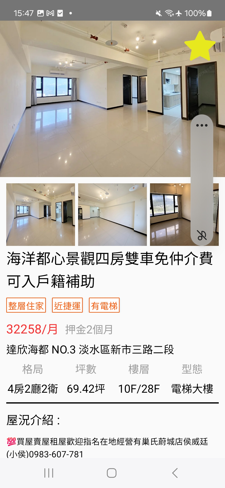
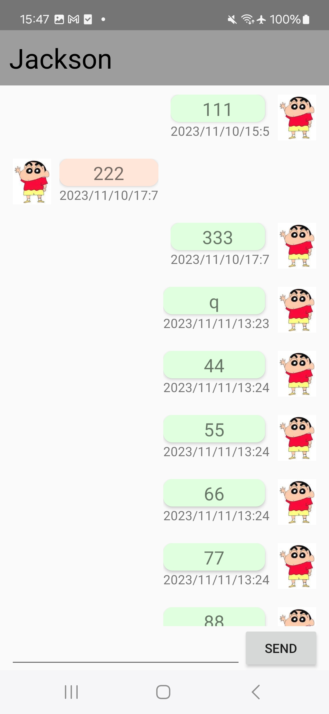

Android 租屋APP
-------------

Android 租屋APP設計,包含以下\n
1. 資料庫使用Firebase
2. 帳號註冊登入功能
3. 房屋物件搜尋
4. 房屋物件展示
5. 房屋物件新增
6. 收藏物件
7. 與屋主訊息聊天功能

| 首頁 | 註冊 |
| :----: | :----: |
|  | |

| 租屋 | 租屋內容 |
| :----: | :----: |
|  | |

| 收藏 | 我的 |
| :----: | :----: |
|  | |

| 訊息 | 聊天畫面 |
| :----: | :----: |
|  | |
